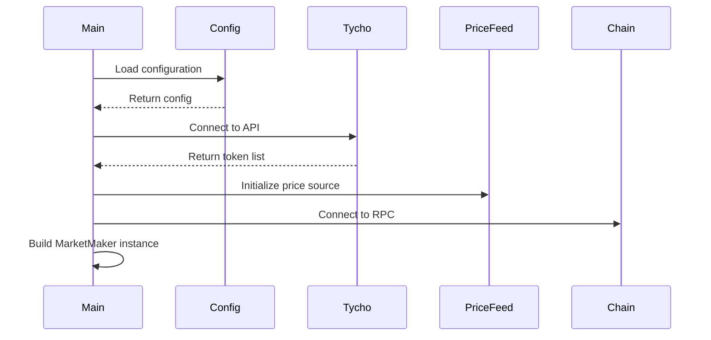
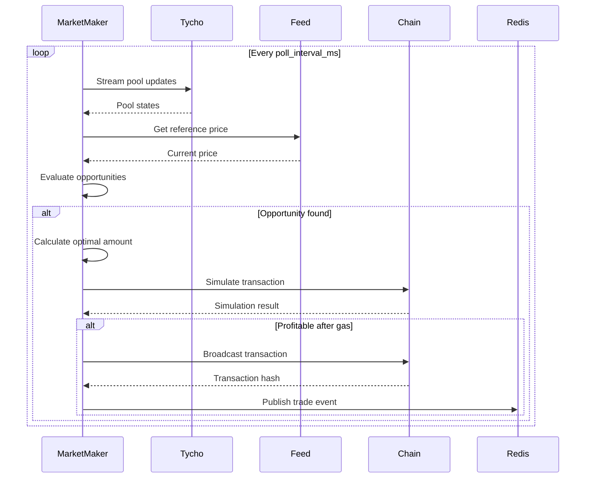

# Architecture Overview

## System Architecture

The Tycho Market Maker is built as a modular, event-driven system designed for high-performance automated trading on decentralized exchanges.

```
┌─────────────────────────────────────────────────────────────┐
│                     External Services                         │
├──────────────┬──────────────┬────────────────┬──────────────┤
│  Tycho API   │  Price Feeds │  Blockchain   │  Monitoring   │
│              │  (Binance/   │  RPC Nodes    │  (Better      │
│              │  Chainlink)  │               │  Stack)       │
└──────┬───────┴──────┬───────┴───────┬────────┴──────┬───────┘
       │              │               │               │
┌──────▼───────────────▼───────────────▼───────────────▼───────┐
│                    Market Maker Core                          │
├────────────────────────────────────────────────────────────────┤
│  ┌──────────────┐  ┌──────────────┐  ┌──────────────┐       │
│  │   Protocol   │  │    Price     │  │  Execution   │       │
│  │   Stream     │  │    Feed      │  │  Strategy    │       │
│  │   Builder    │  │   Manager    │  │   Engine     │       │
│  └──────┬───────┘  └──────┬───────┘  └──────┬───────┘       │
│         │                  │                  │               │
│  ┌──────▼──────────────────▼──────────────────▼───────┐      │
│  │            Market Maker Runtime Loop                │      │
│  │  - Pool Discovery                                   │      │
│  │  - Opportunity Detection                            │      │
│  │  - Trade Optimization                               │      │
│  │  - Risk Management                                  │      │
│  └─────────────────────────┬───────────────────────────┘      │
└─────────────────────────────┼──────────────────────────────────┘
                              │
       ┌──────────────────────┼──────────────────────┐
       │                      │                       │
┌──────▼────────┐      ┌──────▼────────┐     ┌───────▼────────┐
│    Redis      │      │  PostgreSQL   │     │   Monitor      │
│  Pub/Sub      │      │   Database    │     │   Service      │
└───────────────┘      └───────────────┘     └────────────────┘
```

## Core Components

### 1. Market Maker Binary (`maker`)

The main executable that orchestrates all trading operations:

- **Entry Point**: `src/maker.rs`
- **Responsibilities**:
  - Initialize connections to external services
  - Manage the main trading loop
  - Handle crash recovery and restarts
  - Coordinate between subsystems

### 2. Shared Library (`shd`)

Core business logic organized into modules:

```
src/shd/
├── maker/          # Market making logic
│   ├── impl.rs     # IMarketMaker trait implementation
│   ├── feed.rs     # Price feed implementations
│   ├── tycho.rs    # Tycho protocol integration
│   └── exec/       # Execution strategies
├── types/          # Type definitions
├── data/           # Data persistence
├── utils/          # Utilities
└── opti/           # Optimization algorithms
```

### 3. Monitor Service (`monitor`)

Background service for event processing:

- **Entry Point**: `src/monitor.rs`
- **Responsibilities**:
  - Subscribe to Redis events
  - Persist trade data to PostgreSQL
  - Generate analytics
  - Send heartbeat signals

## Data Flow

### 1. Initialization Phase



### 2. Trading Loop



## Key Design Patterns

### 1. Factory Pattern

Dynamic component creation based on configuration:

```rust
// Price feed factory
let feed = PriceFeedFactory::create("binance");

// Execution strategy factory
let strategy = ExecStrategyFactory::create("ethereum");
```

### 2. Builder Pattern

Complex object construction with validation:

```rust
let market_maker = MarketMakerBuilder::new(config, feed, strategy)
    .with_tokens(base, quote)
    .with_risk_limits(limits)
    .build()?;
```

### 3. Strategy Pattern

Pluggable execution strategies per network:

```rust
trait ExecStrategy {
    async fn execute(&self, trade: Trade) -> Result<TxHash>;
}

struct MainnetExec;  // Flashbots integration
struct BaseExec;     // L2 optimizations
struct UnichainExec; // Beta network handling
```

### 4. Event-Driven Architecture

Decoupled components via pub/sub:

```rust
// Publisher (Market Maker)
pub::trade(TradeEvent { ... });

// Subscriber (Monitor)
sub::listen(|event| {
    persist_to_database(event);
});
```

## Concurrency Model

### Async/Await with Tokio

All I/O operations are asynchronous:

```rust
async fn run(&mut self) {
    // Concurrent operations
    let (prices, inventory, context) = tokio::join!(
        self.fetch_prices(),
        self.fetch_inventory(),
        self.fetch_context()
    );
}
```

### Shared State Management

Thread-safe state sharing with Arc<RwLock>:

```rust
let state = Arc::new(RwLock::new(TychoStreamState {
    protosims: HashMap::new(),
    components: HashMap::new(),
}));
```

## Error Handling

### Panic Recovery

Automatic restart on panic with exponential backoff:

```rust
loop {
    match catch_unwind(|| market_maker.run()).await {
        Ok(_) => info!("Clean shutdown"),
        Err(e) => {
            error!("Panic: {:?}, restarting...", e);
            sleep(RESTART_DELAY).await;
        }
    }
}
```

### Result Types

Explicit error handling throughout:

```rust
pub type Result<T> = std::result::Result<T, MarketMakerError>;

enum MarketMakerError {
    Config(String),
    Network(String),
    Insufficient(String),
}
```

## Performance Optimizations

### 1. Pool Filtering

Early filtering to reduce computation:

```rust
// Filter by TVL
if pool.tvl < MIN_TVL { continue; }

// Filter by spread
if spread < min_watch_spread { continue; }

// Filter by price deviation
if deviation > MAX_DEVIATION { continue; }
```

### 2. Lazy Evaluation

Compute expensive operations only when needed:

```rust
// Only optimize if spread is interesting
if spread > min_executable_spread {
    let optimal = find_optimal_amount(...);
}
```

### 3. Caching

Reuse expensive computations:

```rust
struct MarketContext {
    base_to_eth: f64,    // Cached
    quote_to_eth: f64,   // Cached
    eth_to_usd: f64,     // Cached
    block: u64,
}
```

## Security Architecture

### 1. Private Key Isolation

- Never logged or transmitted
- Loaded from environment only
- Used only for transaction signing

### 2. Approval Management

- Permit2 integration for safer approvals
- Optional infinite approval
- Per-transaction approval available

### 3. Validation Layers

Multiple validation before execution:

1. Configuration validation at startup
2. Pool price validation (±5% of reference)
3. Trade simulation before broadcast
4. Slippage protection in transaction

## Modularity

### Pluggable Components

Easy to extend or replace:

- **Price Feeds**: Add new sources by implementing `PriceFeed` trait
- **Execution Strategies**: Network-specific logic in separate modules
- **Data Stores**: Abstract persistence layer

### Configuration-Driven

Behavior controlled via configuration:

```toml
[price_feed_config]
type = "binance"  # or "chainlink", "coingecko", etc.

min_executable_spread_bps = 10.0  # Easily adjustable
```

## Scalability Considerations

### Horizontal Scaling

Run multiple instances with different:
- Trading pairs
- Networks
- Strategies

### Vertical Scaling

Optimize single instance:
- Increase `poll_interval_ms` for more pairs
- Use connection pooling for RPC
- Batch transaction simulations

## Next Steps

- Dive into [Core Components](core-components.md)
- Understand the [Trading Flow](trading-flow.md)
- Learn about [Execution Strategies](execution-strategies.md)
- Explore the [Event System](event-system.md)